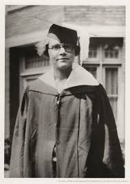
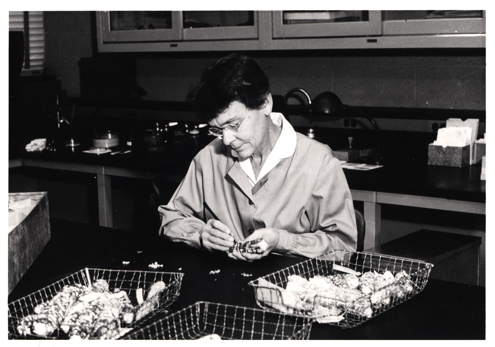
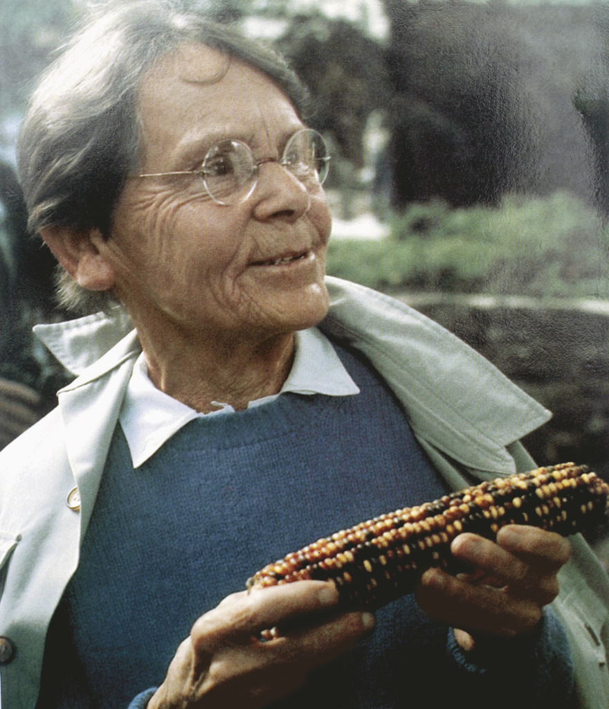
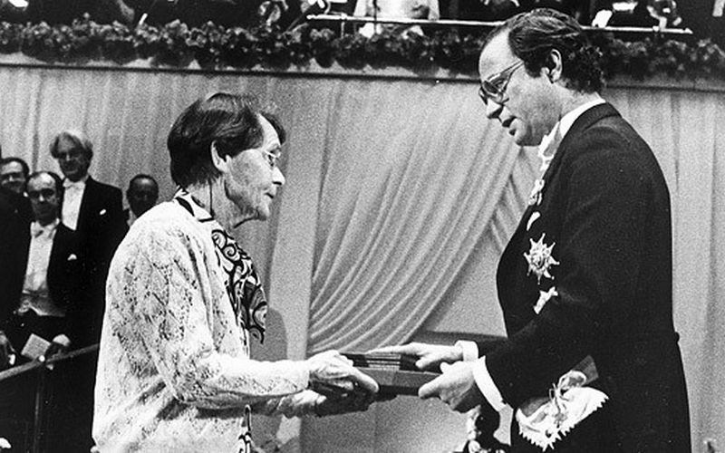

---
title: Who is Barbara McClintock?
date: 2026-03-15
excerpt: "A brilliant woman born in a time built for men."
hero: hero-01.jpeg
--- 

Born as Eleanor, in 1902, she soon became known to family and friends simply as Barbara McClintock, a brilliant woman born in a time built for men. She was the third of four children and, in a house full of kids, she quickly stood out, exhibiting a fiercely independent and intellectually curious mind. I'd like to think it came from her mother, who believed that ++"learners should not only be readers but thinkers as well."++

Nevertheless, that same mother initially vetoed Barbara's plan to go to college, convinced that a degree would harm her chances of getting married and building a family, as was expected of women back then. It was her father who intervened and supported her enrolment above all else. Little did either of them know how that simple, yet bold decision would revolutionise science as we know it today.

## The first years

She pursued her studies at Cornell University, receiving her bachelor's degree in 1923. Four years later she earned a PhD specialising in cytology, genetics, and zoology. Her influence on campus extended well beyond the classroom. She joined the student government and played banjo in a jazz band. And although women were not permitted to major in genetics at Cornell, she became a highly influential member of a small group who studied maize cytogenetics.

Her thirst for knowledge drove her to progress much faster than anyone expected of a woman at that time. Within just two years of finishing her doctorate, she had published six articles, four of them single-authored. From the very beginning, her research focused on chromosomes and how they change during reproduction in maize. She developed the technique for visualising maize chromosomes and used microscopic analysis to demonstrate many fundamental genetic ideas. Together with Harriet Creighton, she demonstrated that genetic crossing-over was accompanied by physical crossing-over of chromosomes, beating the German Drosophila geneticist Curt Stern, who made a similar finding in flies independently, by a matter of weeks.

Perhaps because of that connection, in ==1933==, McClintock received a fellowship to work with Curt Stern in Berlin. Yet once again, time was against her. Like many Jewish scientists, Stern fled Germany amid the rise of Hitler and the spread of antisemitism. McClintock relocated to the Botanical Institute in Freiburg but returned to the United States in 1934 due to the growing political instability. Despite her extraordinary abilities and reputation, she struggled to find permanent employment that matched her talents. Being a woman during the Great Depression had closed most doors, and she sustained herself through fellowships throughout the early 1930s.

It was only in 1936 that she was finally hired as an assistant professor at the University of Missouri, where she encountered X-rays as a tool for studying genetics. But her true passion was never teaching, it was discovery! So, in 1941, she moved to Cold Spring Harbor, New York, accepting a research position at the Carnegie Institution of Washington, where she would spend the rest of her professional life.

It was here, in the late 1940s, that she dared to challenge one of the great dogmas of 20th-century biology:The idea that genes were stable entities arranged in orderly linear patterns on chromosomes, like beads on a string. 

## Her hypothesis? 

That some genes were, in fact, mobile. By observing and experimenting with variations in kernel colouration in maize, she isolated two genetic elements she called =="controlling elements"==, which, according to her findings, could move along the chromosome to a different site and change the behaviour of neighbouring genes.

Needless to say, her work was way ahead of its time and was for many years considered too radical, or simply ignored, by the scientific community. In the summer of 1951, she gave a lecture on her findings at the annual symposium at Cold Spring Harbor Laboratory. Let's just say it didn't go particularly well. Using her own words, some of her fellow scientists simply thought **she was crazy, absolutely mad!** 

### And honestly, can you blame them? 

She was proposing a concept before the molecular structure of DNA was even known, and more than 40 years before epigenetics was formally studied. Not everyone is built to recognise genius when it stands right in front of them. Still, deeply disappointed yet unbroken, she stopped publishing her results and ceased giving lectures, though she never, not even for a day, stopped doing the research.

> "I just knew I was right. Anybody who had had that evidence thrown at them with such abandon couldn't help but come to the conclusions I did about it."

And so, for nearly fifteen years, she worked in quiet solitude, tending her maize, filling her notebooks, trusting her microscope and her own mind when no one else would. Every autumn, colleagues at Cold Spring Harbor would spot her collecting black walnuts on the laboratory grounds, which she later used to bake goods for her favourite few. A woman entirely at peace with her work, entirely unbothered by the noise, or rather, the silence, around it.

## But it's never too late to be recognised!

In the late 1960s and early 1970s, the scientific community finally started to acknowledge her findings, after other biologists had determined that genetic material was DNA. In fact, the theory of genetic regulation put together by the French scientists Jacques Monod and François Jacob bore formal similarities to Barbara's theory of genetic control, a quiet vindication she had earned long before anyone cared to admit it. The formal recognition came in 1971, when President Richard Nixon awarded her the National Medal of Science. During the ceremony, Nixon said: "I have read explanations of your scientific work and I want you to know that I do not understand them", adding that precisely because he didn't understand them, he realised how enormously important they were. The 1980s followed with several other awards, including the Wolf Prize in Medicine (==1981==), the Albert Lasker Basic Medical Research Award (==1981==), and the Louisa Gross Horwitz Prize (==1982==). But the award of all awards "for her discovery of mobile genetic elements" was granted in ++1983++, when she became the first woman to be the sole winner of the Nobel Prize for Physiology or Medicine. She was 81 years old when she finally received the recognition she had deserved for decades.

After the announcement she said:
> "It might seem unfair to reward a person for having so much pleasure over the years, asking the maize plant to solve specific problems and then watching its responses."

Today, we know that 66% of the human genome and 85% of the maize genome is made up of mobile transposable elements, the so-called "jumping genes" that once nobody believed. They are now central to our understanding of epigenetics, genome plasticity, and gene regulation. The woman who was told her ideas were too radical turned out to be the one who had quietly mapped the future of genetics. Not bad for someone whose mother thought college would ruin her prospects.

Barbara McClintock never married, devoting her life to research instead. So yes, she may have failed to accomplish the successful life society expected of her back then, a well-married woman who dedicates herself to the home and her children. But she was beyond doubt a successful woman who persisted through hard times, never stopped believing in her convictions, and became ++a role model for all women still today++.

## References
1. Barbara McClintock. Encyclopaedia Britannica. Retrieved May 2026. https://www.britannica.com/biography/Barbara-McClintock
2. U.S. National Library of Medicine. The Barbara McClintock Papers: Biographical Information. Profiles in Science. Retrieved May 2026. https://profiles.nlm.nih.gov/spotlight/ll/feature/biographical-information 
3. U.S. National Library of Medicine. Biographical Overview: Barbara McClintock. Profiles in Science. Retrieved May 2026. https://profiles.nlm.nih.gov/spotlight/ll/feature/biographical-overview 
4. Cold Spring Harbor Laboratory. Barbara McClintock. Retrieved May 2026. https://www.cshl.edu/personal-collections/barbara-mcclintock/ 
5. National Women's History Museum. Barbara McClintock. Cross-Harris, K. (2025). https://www.womenshistory.org/education-resources/biographies/barbara-mcclintock
6. Nobel Prize Outreach. Barbara McClintock — Facts. NobelPrize.org. Retrieved May 2026. https://www.nobelprize.org/prizes/medicine/1983/mcclintock/facts/ 
7. Nobel Prize Outreach. Barbara McClintock: Women Who Changed Science. NobelPrize.org. Retrieved May 2026. https://www.nobelprize.org/stories/women-who-changed-science/barbara-mcclintock/
8. Pray, L. (2008). Barbara McClintock and the Discovery of Jumping Genes (Transposons). Nature Education / Scitable. https://www.nature.com/scitable/topicpage/barbara-mcclintock-and-the-discovery-of-jumping-34083/ 
9. Ravindran, S. (2012). Barbara McClintock and the Discovery of Jumping Genes. Proceedings of the National Academy of Sciences, 109(50). https://www.pnas.org/doi/10.1073/pnas.1219372109 
10. Feschotte, C. (2023). Plant Jumping Genes: Celebrating the Legacy of Barbara McClintock. Nature. https://www.nature.com/collections/jjefafhbej 
11. Feschotte, C. (2023). Transposable Elements: McClintock's Legacy Revisited. PubMed/NCBI. https://pubmed.ncbi.nlm.nih.gov/37723348/ 
12. Comfort, N. (2012). McClintock's Challenge in the 21st Century. Proceedings of the National Academy of Sciences. https://www.pnas.org/doi/10.1073/pnas.1215482109 
13. Voigt, C. (2024). Barbara McClintock Discovered a Little Thing Called the Transposable Element in 1950. Omic.ly. https://www.omic.ly/mcclintock-transposable-element-1950/ 
14. Embryo Project Encyclopedia. Barbara McClintock's Transposon Experiments in Maize (1931–1951). Arizona State University. https://embryo.asu.edu/pages/barbara-mcclintocks-transposon-experiments-maize-1931-1951
15. Carnegie Science. (2025, March 19). Barbara McClintock: A Visionary Ahead of Her Time. https://carnegiescience.edu/news/barbara-mcclintock-visionary-ahead-her-time 
16. U.S. Department of Energy. (2017, March 16). Five Fast Facts About Barbara McClintock. https://www.energy.gov/articles/five-fast-facts-about-barbara-mcclintock 
17. DNA Learning Center, Cold Spring Harbor Laboratory. Barbara McClintock. DNA from the Beginning. https://www.dnaftb.org/32/bio.html
18. Connecticut Women's Hall of Fame. (2014). Barbara McClintock Tribute Film [Video]. YouTube. https://www.youtube.com/watch?v=5-1yXo5zp1I 
19. Untold Earth. (2025, January 8). Barbara McClintock: Scientific Persistence Pays Off [Video]. YouTube. https://www.youtube.com/watch?v=Ss1umnRZA74 
20. U.S. National Library of Medicine. (2021, February 1). Profiles in Science — Barbara McClintock (1902–1992) [Video]. YouTube. https://www.youtube.com/watch?v=LrY78SwZ3II
